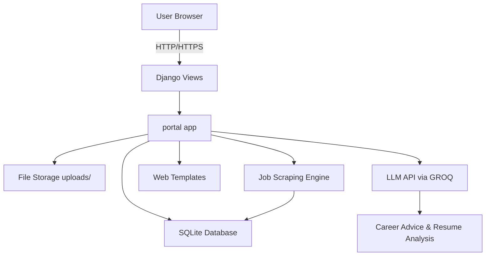

# CareerNeuron-Pro

CareerNeuron-Pro is a Django-based career assistant platform that helps job seekers build profiles, upload resumes, search jobs, receive AI-powered career advice, practice interview questions, and generate cover letters.

## System Architecture

- **Web layer:** Django templates and views inside the `portal` app.
- **Authentication:** Django auth with sign up, login, logout, and profile management.
- **Profile & resume processing:** Users can upload resumes and complete profile sections; the app stores structured profile data in SQLite and file uploads in `uploads/`.
- **AI layer:** `portal/ai_engine.py` uses `langchain_groq` to call an LLM for resume parsing, career advice, cover letters, and interview simulation.
- **Job search:** `portal/scraper.py` scrapes job listings and saves them in the `Job` model.
- **Storage:** Local SQLite database under `db/` and local media storage under `uploads/`.

### Architecture Diagram



## Key Workflows

### 1. User onboarding
1. User registers with email and password.
2. User verifies OTP and logs in.
3. User completes profile details and uploads a resume.

### 2. Resume parsing and profile enrichment
1. Uploaded resume is extracted and parsed.
2. AI engine analyzes resume text and returns structured profile data.
3. Parsed information is saved back to the user profile for editing.

### 3. AI career advisor
1. User submits a career question on the advisor page.
2. The AI engine uses profile context and resume data to return personalized guidance.

### 4. Job discovery
1. User enters a search query on the dashboard.
2. The scraper fetches job listings and persists them in the database.
3. Listings are displayed to the user in order.

### 5. Interview practice
1. User starts the interview module.
2. AI-driven interview questions are generated based on the user profile and target role.
3. The system tracks conversation history and provides realistic interview feedback.

## Deployment

This project is configured for deployment on free Python hosting platforms that support Django, including Render or Railway.

### Included deployment files
- `Procfile` — runs Gunicorn for production.
- `runtime.txt` — pins Python version.
- `requirements.txt` — includes deployment dependencies like `gunicorn` and `whitenoise`.
- `career_neuron/settings.py` — configured with WhiteNoise for static file serving.

### Recommended deploy steps
1. Create a GitHub repository and push the source code.
2. Connect the repo to Render or Railway.
3. Set environment variables from `.env.example`.
4. Install dependencies and run `python manage.py collectstatic --noinput`.
5. Start the web service using one of these commands:
   - `gunicorn career_neuron.wsgi:application --log-file -`
   - `gunicorn app:app --log-file -` (supported if using `app.py` in the repo)

If Render is still using the default command `gunicorn app:app`, use the included `app.py` file or set the start command manually in Render.

## Local setup

1. Create and activate a Python virtual environment.
2. Install dependencies:
   ```bash
   pip install -r requirements.txt
   ```
3. Copy `.env.example` to `.env` and configure secrets.
4. Run migrations:
   ```bash
   python manage.py migrate
   ```
5. Create a superuser (optional):
   ```bash
   python manage.py createsuperuser
   ```
6. Start the app:
   ```bash
   python manage.py runserver
   ```

## Environment variables

- `DJANGO_SECRET_KEY`
- `DJANGO_DEBUG`
- `DJANGO_ALLOWED_HOSTS`
- `RENDER_EXTERNAL_HOSTNAME` (optional, automatically used on Render)
- `EMAIL_BACKEND`
- `EMAIL_HOST`
- `EMAIL_PORT`
- `EMAIL_USE_TLS`
- `EMAIL_USE_SSL`
- `EMAIL_HOST_USER`
- `EMAIL_HOST_PASSWORD`
- `DEFAULT_FROM_EMAIL`
- `GROQ_API_KEY`
- `OLLAMA_BASE_URL`
- `OLLAMA_MODEL`
- `LLM_TIMEOUT_SECONDS`

## Notes

- The project currently uses SQLite for local development.
- For production, set `DJANGO_DEBUG=0` and configure `DJANGO_ALLOWED_HOSTS`.
- If deploying on a free host, make sure to configure environment variables before launch.
